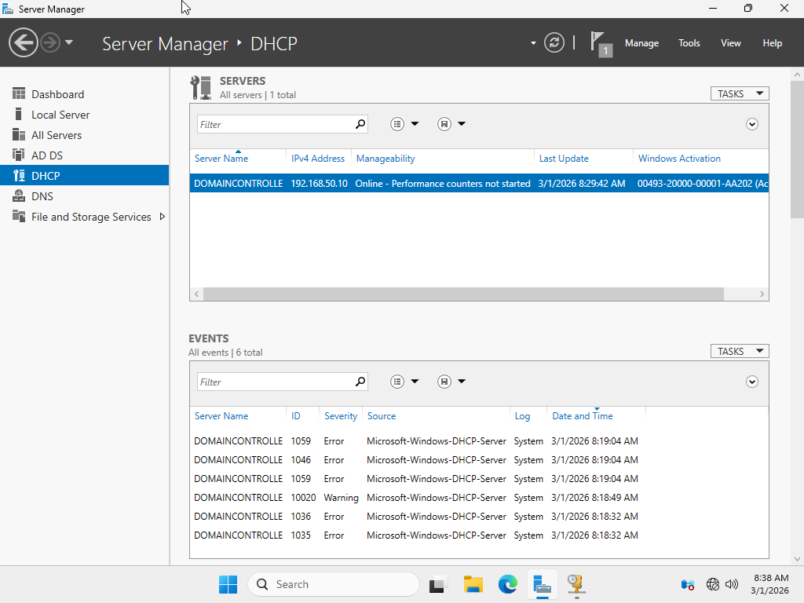
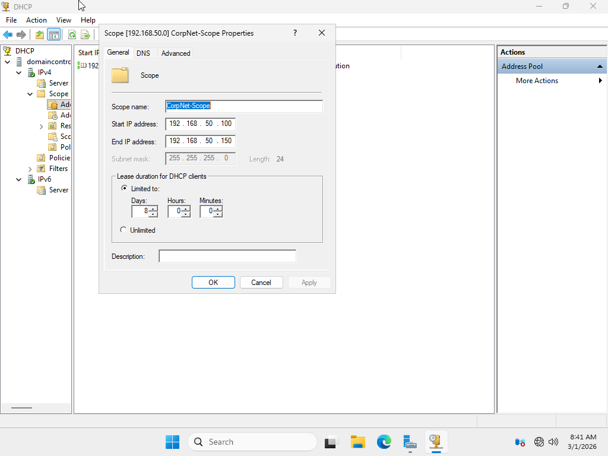
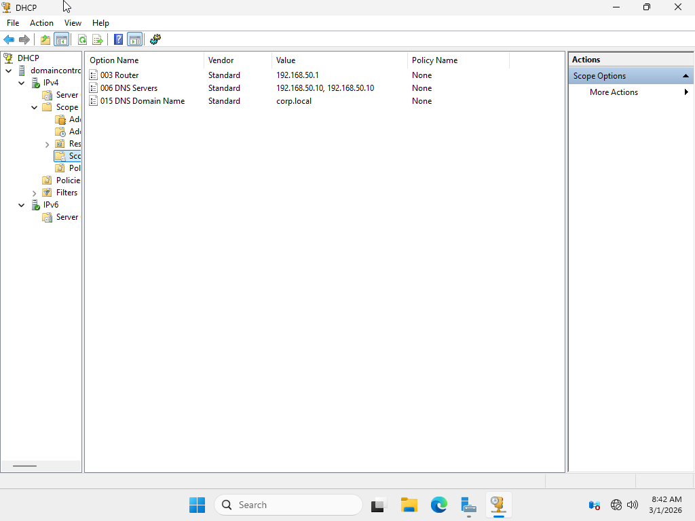
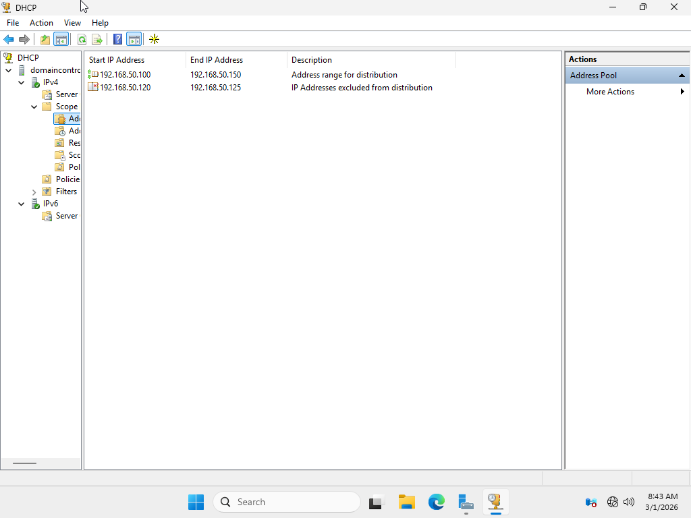
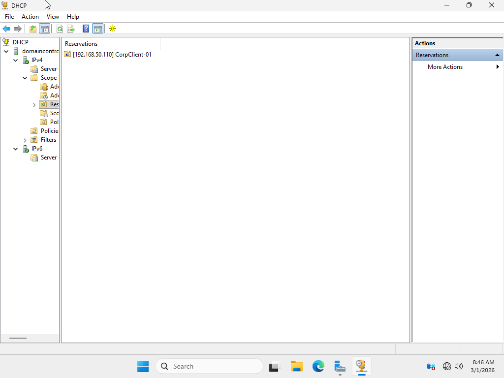
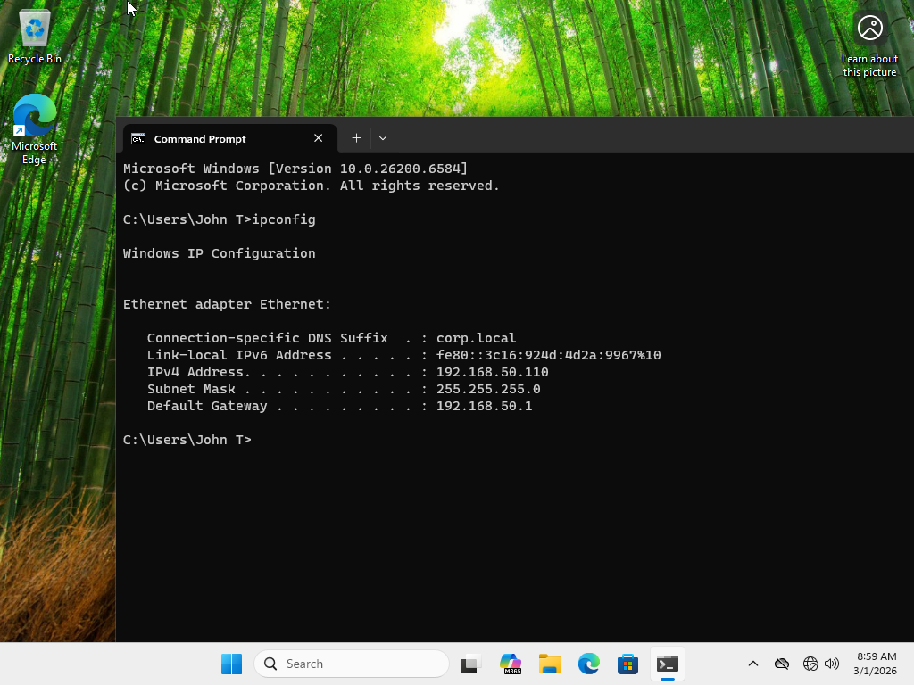
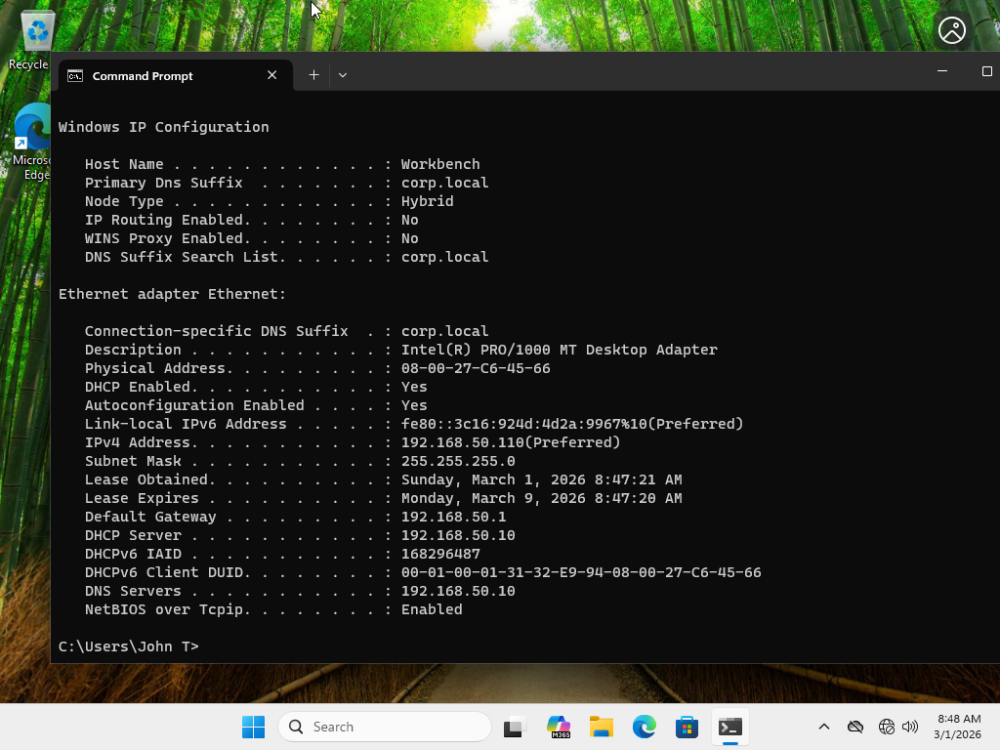
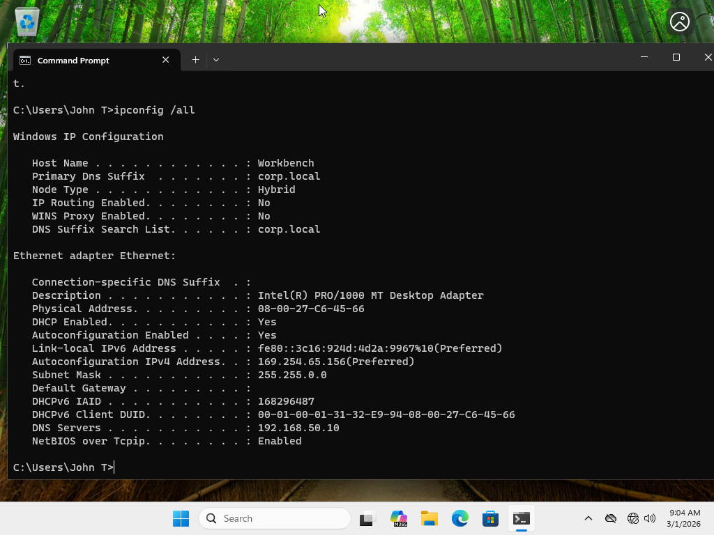

# 🏢 DHCP Server Lab


---

## 🔎 Overview

This project simulates deployment of a centralized DHCP server within an enterprise domain environment. It demonstrates dynamic IP address management, scope configuration, reservations, exclusions, DHCP options, and structured troubleshooting aligned with CompTIA A+ Core 1 objectives.

---

## 🎯 Objectives

- Install and authorize DHCP Server role
- Create and configure DHCP scopes
- Implement exclusions and reservations
- Configure DHCP options (003, 006, 015)
- Adjust lease durations
- Convert client to dynamic addressing
- Perform intentional break testing for troubleshooting practice

---

## 🏗 Architecture


[ Windows Client ]
│
│ Internal Network (CorpNet)
│
[ Windows Server / DHCP + Domain Controller ]


Network Configuration:

Internal Network
Name: CorpNet
Range: 192.168.50.0 /24


---

# 💻 Infrastructure Setup

---

## 🖥 DHCP Server Configuration

| Property | Value |
|----------|--------|
| OS | Windows Server |
| Role Installed | DHCP Server |
| Domain | corp.local |
| Network | CorpNet |
| Server IP | 192.168.50.10 |

### Installed Role
- DHCP Server (Authorized in Active Directory)

---

### 📸 Screenshot – DHCP Role Installed

<p align="center">
  
</p>

---

### 📸 Screenshot – DHCP Authorized in AD

<p align="center">
  
</p>

---

# 🧪 Scope Configuration

## Scope Details

| Setting | Value |
|----------|--------|
| Scope Name | CorpNet-Scope |
| Start IP | 192.168.50.100 |
| End IP | 192.168.50.150 |
| Subnet Mask | 255.255.255.0 |
| Lease Duration | 8 Days |

---

### 📸 Screenshot – Scope Created

<p align="center">
  
</p>

---

## DHCP Options Configured

| Option | Purpose | Value |
|--------|----------|--------|
| 003 | Router | 192.168.50.1 |
| 006 | DNS Server | 192.168.50.10 |
| 015 | DNS Domain | corp.local |

---

### 📸 Screenshot – DHCP Options

<p align="center">
  
</p>

---

# 🚫 Exclusion Range

Configured exclusion:

192.168.50.120 – 192.168.50.125

Purpose:
Reserve addresses for static infrastructure devices (e.g., printers).

---

### 📸 Screenshot – Exclusion Range

<p align="center">
  
</p>

---

# 🔐 Reservation Configuration

## Reservation Details

| Setting | Value |
|----------|--------|
| Name | CorpClient-01 |
| IP Address | 192.168.50.110 |
| MAC Address | (Client MAC) |
| Type | DHCP Only |

---

### 📸 Screenshot – Reservation Created

<p align="center">
  
</p>

---

### 📸 Screenshot – Client Receiving Reserved IP

<p align="center">
  
</p>

---

# ✅ Validation Testing

On Client:

```bash
ipconfig /release
ipconfig /renew
ipconfig /all
```

Expected Result:

IP within configured scope

Correct DNS server

Correct default gateway

Lease duration visible

📸 Screenshot – ipconfig Output
<p align="center">  </p>
🚨 Break & Troubleshooting Scenarios

These scenarios simulate real enterprise DHCP failures.

🔴 Scenario 1 – Scope Deactivated

Action:

Deactivate scope

Renew client IP

Expected Result:
Client receives APIPA (169.254.x.x)

📸 Screenshot – APIPA Address
<p align="center">  </p>
🔴 Scenario 2 – DHCP Deauthorized

Action:

Remove DHCP authorization in AD

Expected Result:
DHCP server stops issuing leases.

🔴 Scenario 3 – Incorrect DNS Option

Action:

Change Option 006 to incorrect IP

Expected Result:
Client receives IP but cannot resolve domain names.

🔴 Scenario 4 – Scope Exhaustion

Action:

Shrink scope to 2 IP addresses

Boot multiple clients

Expected Result:
Address pool exhaustion.

🔴 Scenario 5 – Incorrect Gateway

Action:

Change Option 003 to incorrect IP

Expected Result:
Client receives IP but cannot route beyond local network.

🧠 Technical Concepts Demonstrated

DORA process (Discover, Offer, Request, Acknowledge)

Dynamic IP assignment

DHCP scope design

Exclusions vs reservations

Lease duration management

DHCP authorization in Active Directory

APIPA behavior

Network-layer troubleshooting


📌 Skills Demonstrated

Enterprise IP address management

DHCP infrastructure deployment

Role-based network services configuration

Troubleshooting dynamic addressing failures

Network service dependency analysis

👤 Author

Zachary
Aspiring IT Infrastructure & Networking Professional

Project Version: 1.0
